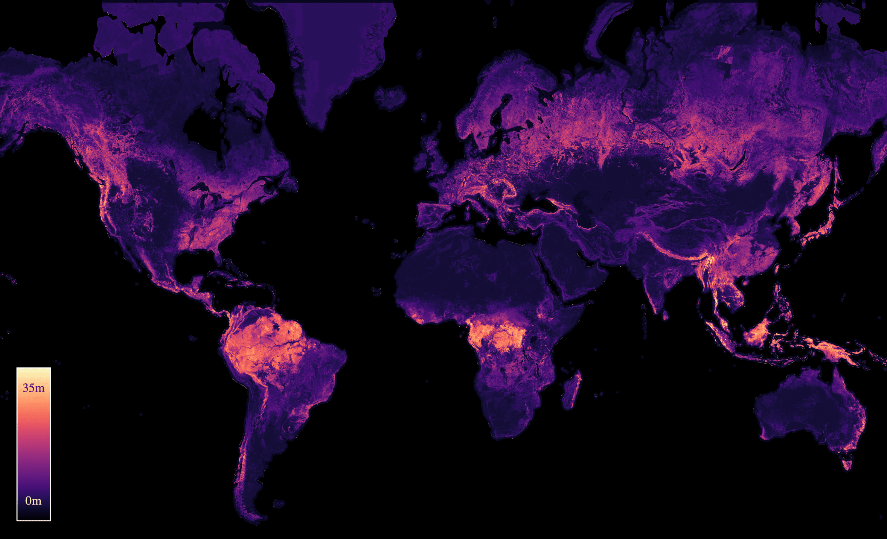
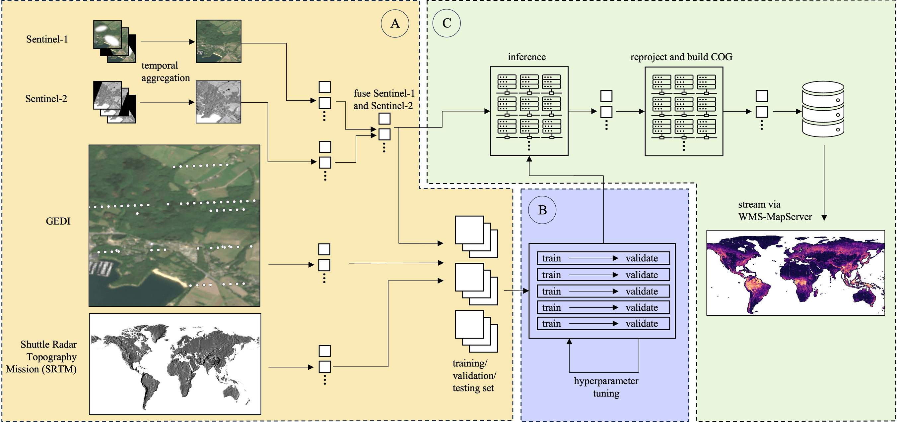
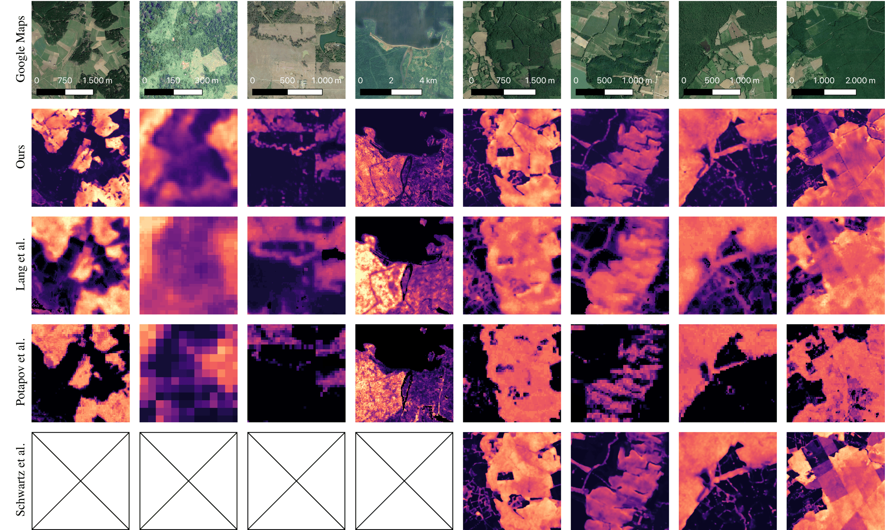

# Estimating Canopy Height at Scale [ICML2024]

[Jan Pauls](https://www.wi.uni-muenster.de/de/institut/dasc/personen/jan-pauls), [Max Zimmer](https://maxzimmer.org), [Una M. Kelly](https://www.wi.uni-muenster.de/de/institut/dasc/personen/una-kelly), [Martin Schwartz](https://www.researchgate.net/profile/Martin-Schwartz-6), [Sassan Saatchi](https://science.jpl.nasa.gov/people/Saatchi/), [Philippe Ciais](https://www.lsce.ipsl.fr/Phocea/Pisp/index.php?nom=philippe.ciais), [Sebastian Pokutta](https://pokutta.com), [Martin Brandt](https://www.researchgate.net/profile/Martin-Brandt-2), [Fabian Gieseke](https://www.wi.uni-muenster.de/department/dasc/people/fabian-gieseke)


[[`Paper`](http://arxiv.org/abs/2406.01076)] [`Google Earth Engine viewer`](https://worldwidemap.projects.earthengine.app/view/canopy-height-2020)] [[`BibTeX`](#citing-the-paper)]



We propose a framework for **global-scale canopy height estimation** based on satellite data. Our model leverages advanced data preprocessing techniques, resorts to a novel loss function designed to counter geolocation inaccuracies inherent in the ground-truth height measurements, and employs data from the Shuttle Radar Topography Mission to effectively filter out erroneous labels in mountainous regions, enhancing the reliability of our predictions in those areas. A comparison between predictions and ground-truth labels yields an MAE / RMSE of 2.43 / 4.73 (meters) overall and 4.45 / 6.72 (meters) for trees taller than five meters, which depicts a substantial improvement compared to existing global-scale maps. The resulting height map as well as the underlying framework will facilitate and enhance ecological analyses at a global scale, including, but not limited to, large-scale forest and biomass monitoring.



A comparison between our map and two other existing global height maps (Lang et al., Potapov et al.), as well as a regional map for France reveals that the visual quality improved a lot. It closely matches the one from regional maps, albeit some regions with remaining quality differences (e.g. column 8)



## Interactive Google Earth Engine viewer
We uploaded our produced canopy height map to Google Earth Engine and created a [GEE app](https://worldwidemap.projects.earthengine.app/view/canopy-height-2020) that allows users to visualize our map globally and compare it to other existing products. If you want to build your own app or download/use our map in another way, you can access the map under the following asset_id:

```
var canopy_height_2020 = ee.ImageCollection('projects/worldwidemap/assets/canopyheight2020')

# To display on the map, create the mosaic:
var canopy_height_2020 = ee.ImageCollection('projects/worldwidemap/assets/canopyheight2020').mosaic()
```

## Acknowledgements

This paper is part of the project *AI4Forest*, which is funded by the
German Aerospace Agency
([DLR](https://github.com/AI4Forest/Global-Canopy-Height-Map)), the
german federal ministry for education and research
([BMBF](https://www.bmbf.de/bmbf/en/home/home_node.html)) and the french
national research agency ([anr](https://anr.fr/en/)). Further,
calculations (or parts of them) for this publication were performed on
the HPC cluster PALMA II of the University of Münster, subsidised by the
DFG (INST 211/667-1).

## Citing the paper

If you use our map in your research, please cite using the following BibTex:

```
@inproceedings{pauls2024estimating,
title={Estimating Canopy Height at Scale},
author={Jan Pauls and Max Zimmer and Una M. Kelly and Martin Schwartz and Sassan Saatchi and Philippe CIAIS and Sebastian Pokutta and Martin Brandt and Fabian Gieseke},
booktitle={Forty-first International Conference on Machine Learning},
year={2024},
url={https://openreview.net/forum?id=ZzCY0fRver}
}
```
